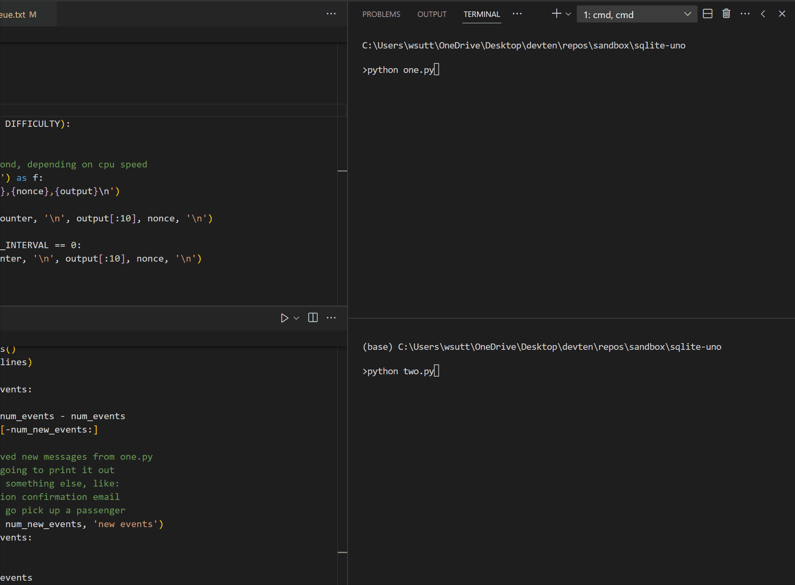

# Basics of Queues

### First Example: With a file

Execute the following commands in separate the terminal:

```bash
> python one.py
```

```bash
> python two.py
```

Demo:

<!-- link to jpg -->
<!--  -->

### Second Example: With a database

**TODO**
